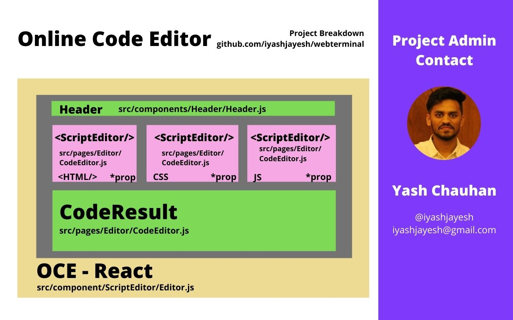

# Online Code Editor

Online Code Editor is a project where user can test their HTML, CSS, JS code online. Just like CodePen! 

<!--  -->
 
## Open For Contributions

<br />
  <p align="center">
    <br />
    <a href="https://oce-react.netlify.app/">View Demo</a>
    ·
    <a href="https://github.com/iyashjayesh/OCE-React/issues">Report Bug</a>
    ·
    <a href="https://github.com/iyashjayesh/OCE-React/issues">Request Feature</a>
  </p>
</p>

<!-- TABLE OF CONTENTS -->

## Table of Contents
- [Project Breakdown](#project-breakdown)
- [About the Project](#about-the-project)
  - [Built With](#built-with)
- [Getting Started](#getting-started)
  - [Prerequisites](#prerequisites)
  - [Installation](#installation)
- [Usage](#usage)
- [Roadmap](#roadmap)
- [Contribution](#contribute)
- [Contact](#maintainer)

<!-- Project Breakdown -->
## Project Breakdown 

<p align="center">

</p>

<!-- ABOUT THE PROJECT -->

## About The Project

Online Code Editor is a project where user can test their HTML, CSS, JS code online. Just like CodePen! 
Online Code Editor will help the user to test their code online. Even users can switch the modes (Dark & Light). Wherein LocalStorage, React Hooks, Bootstrap Library was used to develop the project.
You can use it live here: <a href="https://github.com/iyashjayesh/OCE-React">Online Code Editor</a>

### Built With

- [React](https://reactjs.org/)

<!-- GETTING STARTED -->

## Getting Started

To get a local copy up and running follow these simple steps.

### Prerequisites

This is an example of how to list things you need to use the software and how to install them.

- npm

```sh
npm install npm@latest -g
```

### Installation

1. Clone the repo

```sh
git clone https://github.com/iyashjayesh/OCE-React.git
```

2. Install NPM packages

```sh
npm install 
```

<!-- USAGE EXAMPLES -->

## Usage

The primary goal of this project is to help you learn basic Linux commands in your browser itself.

_For more examples, please refer to the [Working Demo](https://oce-react.netlify.app/)_

<!-- ROADMAP -->

## Roadmap

See the [open issues](https://github.com/iyashjayesh/OCE-React/issues) for a list of proposed features (and known issues).

<!-- CONTRIBUTING -->

## Contribute
> Open to Contribution. 

## Maintainer
Important decisions regarding the project are taken by the following maintainer.

| Yash        |
| :-------------: |
|       |
| [@iyashjayesh](https://github.com/iyashjayesh)      |


## Deployment
<a href="https://oce-react.netlify.app/"></a>
